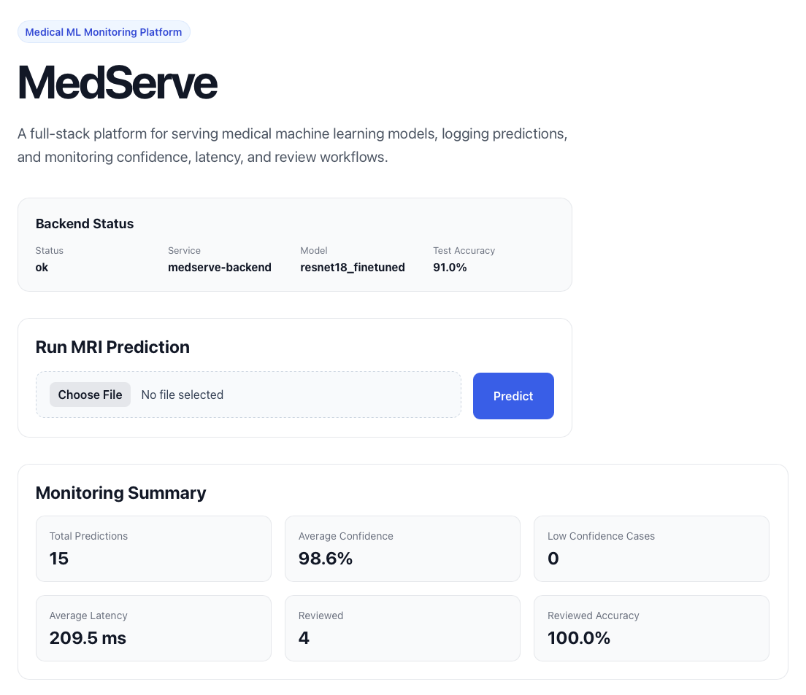
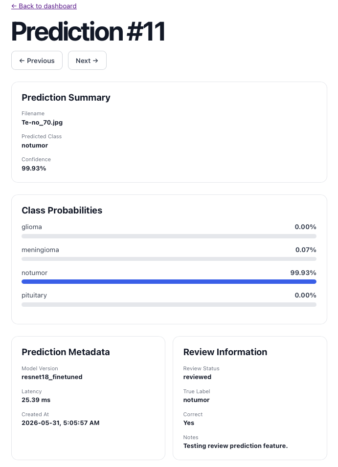
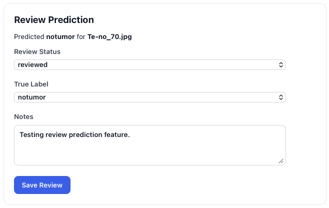
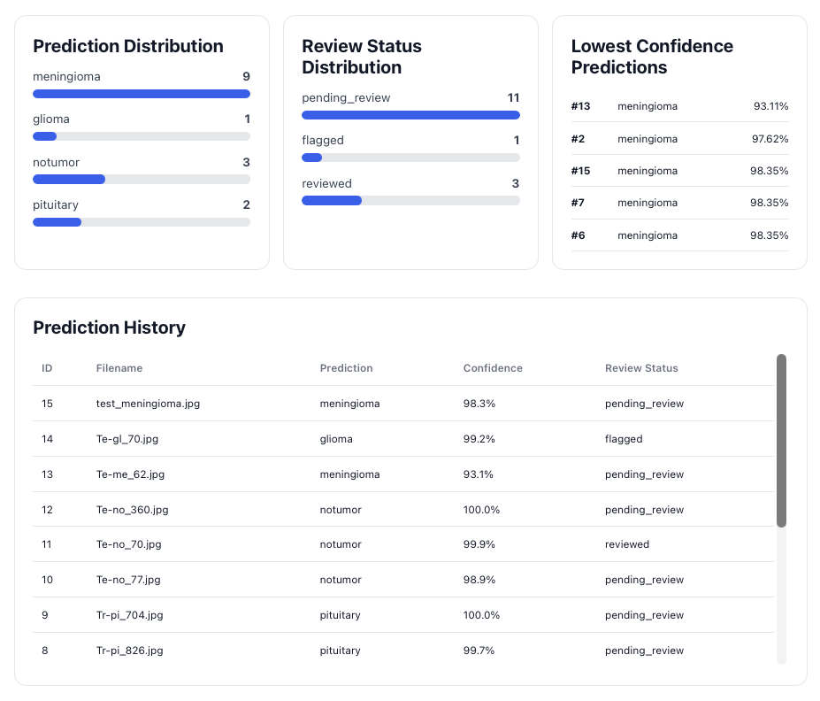

# MedServe

A full-stack medical machine learning platform for serving brain MRI classification models, logging predictions, and monitoring model performance through an interactive dashboard.

---

## Overview

MedServe was built to simulate a production-ready machine learning deployment workflow for medical imaging applications.

The platform allows users to:

- Upload brain MRI images
- Run inference using a fine-tuned ResNet18 model
- View prediction confidence scores
- Explore class probability distributions
- Log prediction metadata
- Review and validate model predictions
- Monitor model performance through a dashboard

The project combines machine learning, backend development, database management, frontend development, and deployment into a single end-to-end system.

---

## Screenshots

### Dashboard


### Prediction Details


### Review Workflow


### Monitoring Charts


---

## Features

### MRI Classification

- Upload MRI images through a web interface
- Predict one of four classes:
  - Glioma
  - Meningioma
  - Pituitary Tumor
  - No Tumor
- Display confidence scores
- Display full class probability distributions

### Prediction Logging

Every prediction is stored with:

- Filename
- Predicted class
- Confidence score
- Probability distribution
- Model version
- Latency
- Timestamp
- Review metadata

### Review Workflow

Users can:

- Mark predictions as reviewed
- Flag questionable predictions
- Assign true labels
- Leave review notes
- Track prediction correctness

### Monitoring Dashboard

Dashboard metrics include:

- Total predictions
- Average confidence
- Average latency
- Reviewed predictions
- Reviewed accuracy
- Low-confidence cases

Dashboard visualizations include:

- Prediction distribution
- Review status distribution
- Lowest-confidence predictions

### Prediction Detail Pages

Each prediction receives a dedicated page showing:

- Prediction summary
- Class probabilities
- Model metadata
- Review information
- Review editing tools
- Previous/next prediction navigation

---

## Architecture

```text
React + TypeScript Frontend
            │
            ▼
      FastAPI Backend
            │
            ▼
      PyTorch Model
            │
            ▼
      SQLite Database
```

### Frontend

- React
- TypeScript
- Vite
- CSS

### Backend

- FastAPI
- SQLAlchemy
- Pydantic
- Uvicorn

### Machine Learning

- PyTorch
- Torchvision
- ResNet18 Transfer Learning

### Database

- SQLite

### Deployment

- Vercel (Frontend)
- Render (Backend)

---

## Model Information

### Architecture

Fine-tuned ResNet18

### Classes

- Glioma
- Meningioma
- No Tumor
- Pituitary Tumor

### Training Results

| Metric | Value |
|----------|----------|
| Validation Accuracy | ~95.5% |
| Test Accuracy | ~91.0% |

### Dataset

This project was trained and evaluated using the Brain Tumor MRI Dataset by Masoud Nickparvar on Kaggle.

Dataset Link:
https://www.kaggle.com/datasets/masoudnickparvar/brain-tumor-mri-dataset

The dataset contains MRI scans across four classes:

- Glioma
- Meningioma
- Pituitary Tumor
- No Tumor

The dataset includes separate training and testing splits and was used to train and evaluate a fine-tuned ResNet18 classifier.

---

## Related Project

MedServe was built on top of the Brain Tumor MRI Classification project, which focused on training and evaluating deep learning models for brain tumor detection from MRI scans.

The classification project explored convolutional neural networks and transfer learning techniques, achieving approximately 91.0% test accuracy on the Brain Tumor MRI Dataset.

MedServe extends that work by providing:

- Model serving through a FastAPI backend
- Prediction logging and storage
- Monitoring dashboards
- Review workflows
- Interactive web-based inference

Repository:

https://github.com/krishivs77/brain-tumor-mri-classification

---

## Example Workflow

1. Upload MRI image
2. Model generates prediction
3. Prediction is stored in database
4. Dashboard metrics update
5. Prediction appears in history
6. Reviewer validates prediction
7. Accuracy statistics update

---

## API Endpoints

### Health

```http
GET /health
```

### Model Information

```http
GET /model-info
```

### Predict

```http
POST /predict
```

### Prediction History

```http
GET /predictions
```

### Prediction Details

```http
GET /predictions/{prediction_id}
```

### Update Review

```http
PATCH /predictions/{prediction_id}/review
```

### Metrics

```http
GET /metrics/summary
```

---

## Local Setup

### Clone Repository

```bash
git clone https://github.com/krishivs77/medserve.git
cd medserve
```

### Backend

```bash
cd backend

python -m venv .venv
source .venv/bin/activate

pip install -r requirements.txt

uvicorn app.main:app --reload
```

Backend:

```text
http://127.0.0.1:8000
```

API Docs:

```text
http://127.0.0.1:8000/docs
```

### Frontend

```bash
cd frontend

npm install
npm run dev
```

Frontend:

```text
http://localhost:5173
```

---

## Future Improvements

### Explainability

- Grad-CAM visualizations
- Saliency maps
- Model interpretation tools

### Deployment

- ONNX model optimization
- Dedicated inference infrastructure
- Docker containerization

### Data Management

- PostgreSQL database
- Cloud object storage
- Dataset versioning

### Product Features

- User authentication
- Role-based review system
- Batch inference
- Exportable reports

### MLOps

- Model version registry
- Automated evaluation pipeline
- Drift detection
- Continuous deployment

---

## Lessons Learned

This project provided experience with:

- Full-stack software engineering
- Machine learning deployment
- REST API design
- Database integration
- Frontend architecture
- Model serving workflows
- Production deployment challenges
- Monitoring and observability concepts

---

## Author

Krishiv Shah

Integrated Biomedical Engineering & Health Sciences (iBioMed)

McMaster University